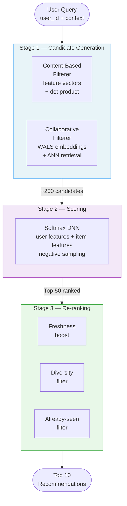
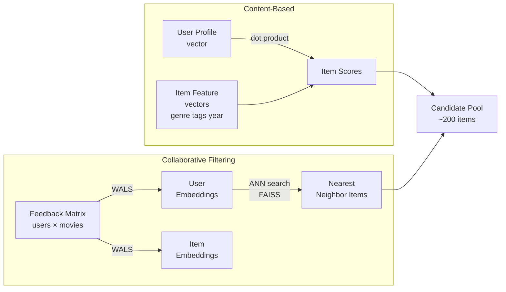
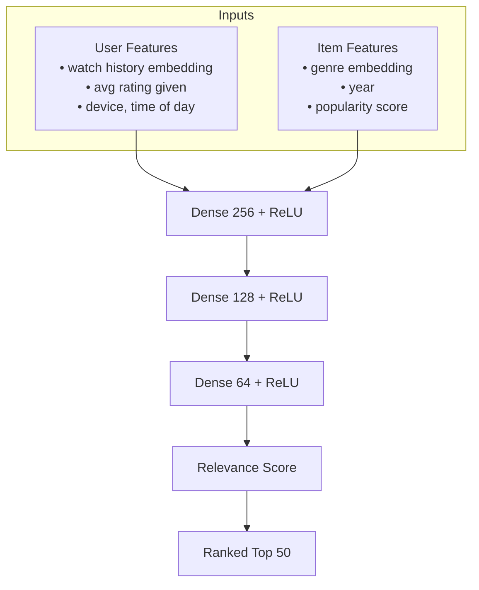
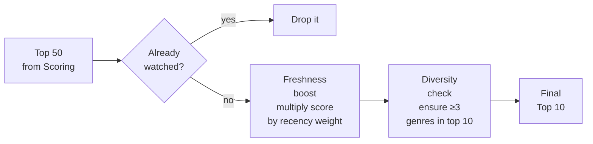

# Movie Recommendation System

An end-to-end recommendation system built to demonstrate every major concept from Google's [Machine Learning for Recommendation Systems](https://developers.google.com/machine-learning/recommendation) course.

**Dataset:** MovieLens 1M — ~6,000 movies, 4,000 users, 1 million ratings.

---

## The Core Idea

You cannot rank everything. With millions of items, the only practical architecture is progressive filtering: use cheap models to eliminate most candidates fast, then spend compute on a tiny fraction of the corpus.

```
Millions of items
      │
      ▼
┌─────────────────────┐
│  Candidate          │  Billions → Hundreds
│  Generation         │  Cheap. Fast. Coarse.
└─────────────────────┘
      │
      ▼
┌─────────────────────┐
│  Scoring            │  Hundreds → Top 50
│                     │  Expensive. Accurate.
└─────────────────────┘
      │
      ▼
┌─────────────────────┐
│  Re-ranking         │  Top 50 → Top 10
│                     │  Business logic. Diversity. Fairness.
└─────────────────────┘
      │
      ▼
  10 results shown to user
```

---

## System Architecture



---

## Candidate Generation: Two Methods

Both generators feed into the same scoring stage. Their outputs are pooled and deduplicated before scoring.



**Content-based** — Uses hand-crafted feature vectors. Genre, year, director tags. Scores by dot product between user profile and item vectors. Fully personalized. No data from other users needed. Can't go beyond what the user has already shown interest in.

**Collaborative filtering** — Learns embeddings from the feedback matrix alone. Users and items that share interaction patterns end up close in embedding space. Produces serendipitous recommendations. Suffers from cold-start: new items with no ratings have no embedding.

---

## Matrix Factorization

The feedback matrix A is decomposed into two low-dimensional matrices: user embeddings U and item embeddings V. Their product approximates A.

```
         U (users × d)         V^T (d × items)
              ┌───┐                 ┌─────────────┐
   users ──▶  │   │    ×            │             │  ──▶  Â ≈ A
              └───┘                 └─────────────┘
                d latent dimensions
```

**Why not minimize error on observed entries only?** Because the matrix is 99%+ empty. Fitting only observed values overfits and ignores the signal in what users *didn't* rate.

**Weighted Matrix Factorization (WMF):**

```
Loss = Σ(observed) w_ij(A_ij - U_i · V_j)² + w₀ Σ(unobserved) (U_i · V_j)²
```

The `w₀` hyperparameter controls how much weight to give unobserved entries (implicit negatives). Tuning this is one of the most impactful things you can do.

**WALS vs. SGD:**

| | WALS | SGD |
|---|---|---|
| **Approach** | Alternate: fix U, solve for V. Fix V, solve for U. | Gradient steps on random batches |
| **Convergence** | Guaranteed | Not guaranteed |
| **Speed** | Faster for this objective | Slower, more general |
| **Negatives** | Handles unobserved natively | Requires negative sampling |

WALS wins for matrix factorization. SGD wins when you need flexibility (e.g., adding side features).

---

## Embedding Space Visualization

After training, items cluster by genre in embedding space — even though WALS never saw genre labels. It learned this structure purely from co-watching patterns.

> Run `python phase_1/visualize.py` to generate the genre cluster plots.

A user who rates a lot of action movies will have a query embedding that lands near the Action cluster — pulling those items into candidates.

**Similarity metrics matter here:**

| Metric | Sensitive To | Risk |
|---|---|---|
| Cosine | Direction only | Treats niche and popular items equally |
| Dot product | Direction + magnitude | Over-promotes popular items (large norm) |
| Euclidean | Physical distance | Balanced; correlates with dot product when normalized |

---

## Scoring Model (DNN)

Takes ~200 candidates and ranks them. Can afford heavier computation because the input is small.



**Why a DNN instead of more matrix factorization?** Matrix factorization learns one fixed embedding per user. A DNN learns a *function* from features to embeddings — it can generalize to unseen users and naturally incorporates side features like device type or time of day.

**Training challenge — negative sampling:**
You can't compute the softmax loss over all 6,000 movies every step. Instead: train on all positives + a sampled subset of negatives. Hard negatives (items the model scores high but shouldn't) teach the most.

**Positional bias:** If a movie appears in spot #1, it gets more clicks regardless of quality. Solution: during scoring, treat every candidate as if it appears in position #1. Don't let screen placement contaminate your training signal.

---

## Re-ranking



**Why re-ranking exists:** Pure ML scores optimize a proxy metric (clicks, watch time). Re-ranking is where you enforce what you actually want: fresh content surfaces, users don't see the same genre 10 times, already-seen movies are removed.

---

## API

```
GET /recommend?user_id=123

Response:
{
  "user_id": 123,
  "pipeline": {
    "candidates_generated": 210,
    "after_scoring": 50,
    "after_reranking": 10
  },
  "recommendations": [
    { "movie_id": 456, "title": "...", "score": 0.94, "genres": ["Action"] },
    ...
  ]
}

GET /similar?movie_id=456    ← precomputed item-item embeddings
```

Each stage is a separate function. The pipeline is inspectable — you can see how many candidates survive each cut.

---

## Build Phases

### Phase 1 — Data & Embeddings ✓

**What we built:**

| File | What it does |
|---|---|
| `phase_1/data.py` | Loads ratings, movies, users from MovieLens 1M |
| `phase_1/matrix.py` | Builds the sparse user × movie feedback matrix |
| `phase_1/wals.py` | Trains WALS, produces 32-dim user and item embeddings |
| `phase_1/visualize.py` | PCA projection of embeddings, genre cluster plots |
| `phase_1/similarity.py` | Compares cosine, dot product, Euclidean on real queries |

---

#### Dataset Stats

| | |
|---|---|
| Users | 6,040 |
| Movies | 3,706 |
| Ratings | 1,000,209 |
| Matrix density | **4.47%** — 95.5% of entries are empty |
| Ratings per user | min 20 · median 96 · max 2,314 |
| Ratings per movie | min 1 · median 124 · max 3,428 |

The 4.47% density is the central challenge. Every algorithm in this project exists because of that emptiness.

---

#### WALS Training

- 32 latent factors, 20 iterations, converged in ~8 seconds
- Confidence weights: `1 + 10 × rating` — a 5-star rating carries 10× more weight than a 1-star
- Unobserved entries treated as weak negatives, not ignored

---

#### Embedding Visualization

PCA compresses each movie's 32-dimensional embedding down to 2D so we can plot it. Two movies close together = their viewers heavily overlap. Two movies far apart = different audiences.

> Run `python phase_1/visualize.py` to generate the genre cluster plots.

---

#### Key Findings

**1. Genre separation emerged without genre labels.**
WALS never saw genre metadata. It only saw who watched what. Yet Animation, Documentary, and Horror ended up in clearly separate regions. The model reverse-engineered genre structure from co-watching patterns alone.

**2. Tighter cluster = more distinct audience.**
Animation and Documentary are the tightest clusters — their viewers rarely stray into other genres. Action is the most scattered — action fans also watch thriller, sci-fi, adventure, war. The cluster shape tells you how niche or broad a genre's audience is.

**3. Dot product promotes popular movies regardless of relevance.**
For both Toy Story and L.A. Confidential, dot product surfaced American Beauty in the top 5. Those movies share almost no thematic overlap — but American Beauty has a massive embedding norm from its large viewership. Dot product rewards popularity. Cosine and Euclidean don't.

| Metric | Toy Story top result | L.A. Confidential top result |
|---|---|---|
| Cosine | Toy Story 2 ✓ | Fargo ✓ |
| Dot product | Groundhog Day (popular, off-genre) | American Beauty (popular, off-genre) |
| Euclidean | Toy Story 2 ✓ | Fargo ✓ |

**Use cosine for genre similarity. Dot product only if you want popularity baked in.**

---

**Course modules covered:** Candidate Generation (overview), Collaborative Filtering, Matrix Factorization

---

### Phase 2 — Candidate Generation ✓

**What we built:**

| File | What it does |
|---|---|
| `phase_2/content_based.py` | Genre vectors + weighted user profile + dot product scoring |
| `phase_2/collaborative.py` | WALS embeddings + nearest-neighbor retrieval |
| `phase_2/pool.py` | Merges both generators, deduplicates |

---

#### How Content-Based Works

Each movie is a binary genre vector (18 dims, derived from data). The user profile is a weighted average of all genre vectors for movies they rated — higher-rated movies pull harder.

```
User rates:   Toy Story ★★★★★ + Lion King ★★★★ + Schindler's List ★★★★★
                    ↓ weighted average
User profile: [Animation=0.64, Children's=0.64, Comedy=0.64, Drama=0.36, ...]
                    ↓ dot product with every unseen movie
Candidates:   movies whose genre vectors align with the profile
```

Score every unseen movie by dot product. Return top 100.

#### How Collaborative Filtering Works

Uses the WALS embeddings from Phase 1. Each user has a 32-dim embedding that captures their position in "taste space." Find the movies whose embeddings sit closest to the user's embedding — those are the movies that users with similar behavior patterns tended to watch.

```
User embedding → nearest neighbor search over item embeddings
→ movies watched by people who watch what you watch
→ filter out already-seen → top 100 candidates
```

At production scale (millions of items) this uses FAISS or ScaNN for approximate nearest neighbor search. At 3,706 movies sklearn brute-force runs in under 1ms.

---

#### Candidate Pool Stats

| | |
|---|---|
| Content-based candidates per user | 100 |
| Collaborative candidates per user | 100 |
| Combined pool after deduplication | ~170–190 |
| Overlap between generators | ~10–30 movies |

---

#### Key Findings

**1. The two generators recommend completely different movies.**
Content-based for user 1 returned only animated children's films — locked to what they explicitly rated. Collaborative returned Star Wars, Raiders of the Lost Ark, Shawshank Redemption — movies user 1 never rated but users with similar animation taste also loved. Neither generator alone is enough.

**2. Overlap is a strong signal.**
The 10–30 movies that appear in both candidate lists are the most confident recommendations. They satisfy two independent criteria: they match the user's genre fingerprint AND they match the co-watching patterns of similar users.

**3. Content-based has no serendipity.**
If a user only rated one genre, content-based only returns that genre. It cannot discover what users don't already know they like. Collaborative has no such limitation — it routes around genre entirely.

**4. Collaborative has no cold-start.**
A new movie with zero ratings has no WALS embedding, so collaborative filtering can't surface it. Content-based can recommend it the moment you know its genre. Each generator covers the other's blind spot.

---

**Course modules covered:** Content-Based Filtering, Collaborative Filtering, Retrieval

---

### Phase 3 — Scoring DNN
- Softmax DNN with user + item features
- Embedding lookup layers for sparse features
- Negative sampling during training
- Evaluate on holdout ratings

**Course modules covered:** 6, 8

---

### Phase 4 — Re-ranking
- Freshness score multiplier
- Genre diversity constraint
- Already-seen filter
- Positional bias experiment: model with vs. without position as a feature

**Course modules covered:** 9

---

### Phase 5 — Serve It
- FastAPI endpoint wrapping the full pipeline
- `/recommend` and `/similar` routes
- Pipeline metadata in response (candidate counts per stage)

---

### Stretch Goals
- Two-tower model for candidate generation (handles cold-start)
- WALS vs. SGD training comparison
- Fairness audit: recommendation quality for niche genres vs. blockbusters

---

## Tech Stack

| Layer | Tool |
|---|---|
| Data | MovieLens 1M, pandas |
| Matrix factorization | `implicit` (WALS) |
| DNN | TensorFlow / Keras |
| ANN retrieval | FAISS |
| Visualization | matplotlib, seaborn |
| API | FastAPI |

---

## Course Reference

Built to demonstrate [Google's ML for Recommendation Systems course](https://developers.google.com/machine-learning/recommendation).

| Phase | Course Modules |
|---|---|
| Embeddings + matrix factorization | Candidate Generation, Matrix Factorization |
| Candidate generation | Content-Based Filtering, Collaborative Filtering, Retrieval |
| Scoring DNN | DNNs for Recommendation, Scoring |
| Re-ranking | Re-ranking |
| Full pipeline | Overview, The Three-Stage Pipeline |
