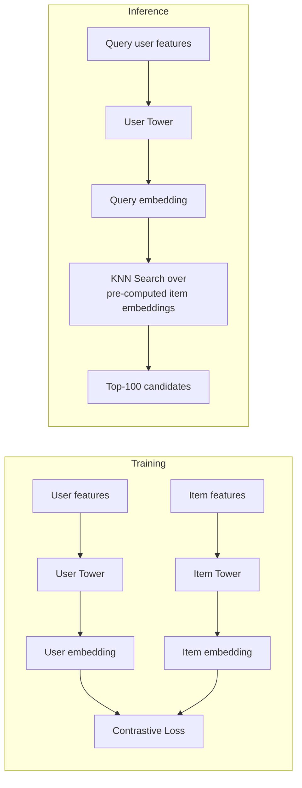
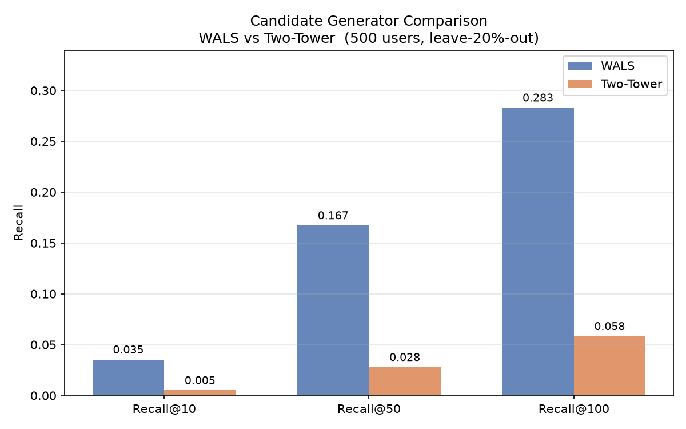
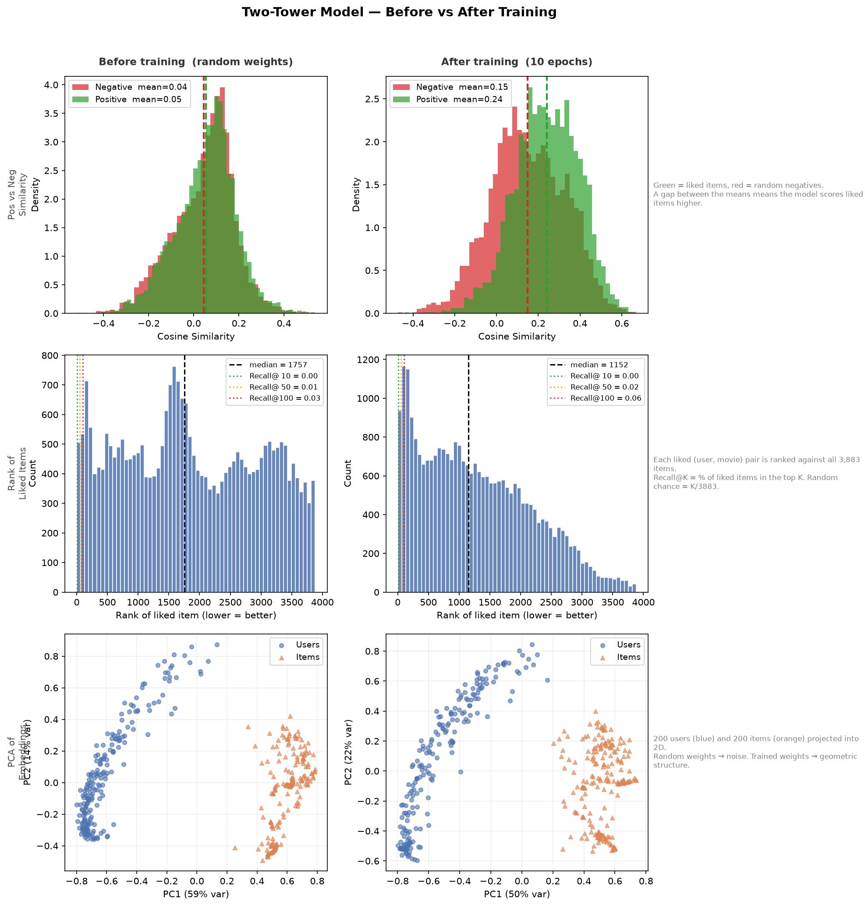

# Two-Tower Model for Candidate Generation

A stretch goal extending the main recommendation pipeline. Replaces the WALS-based collaborative filtering generator with a two-tower neural network that handles cold-start users and items.

---

## The Problem with WALS

WALS learns a fixed embedding for every user and item in the training set. That works well — but it breaks the moment you see something new.

- **New user** — no ratings, no embedding, no recommendations
- **New item** — no ratings, no embedding, never surfaced

This is the cold-start problem. WALS can't solve it because it memorises embeddings rather than learning a function.

---

## The Two-Tower Solution

Instead of memorising an embedding per entity, train two neural networks — one for users, one for items — that map **features** to embeddings.

```
User Features (20 dims)          Item Features (20 dims)
avg_rating, activity,            year, popularity,
genre_profile...                 genre_vector...
        │                                │
        ▼                                ▼
┌───────────────┐              ┌───────────────┐
│  User Tower   │              │  Item Tower   │
│  Dense(64)    │              │  Dense(64)    │
│  Dense(32)    │              │  Dense(32)    │
│  Dense(16)    │              │  Dense(16)    │
└───────────────┘              └───────────────┘
        │                                │
        ▼                                ▼
  User Embedding                  Item Embedding
     (16 dims)                      (16 dims)
        │                                │
        └──────── cosine similarity ─────┘
                        │
                  High = relevant
                  Low  = not relevant
```

For a new user, you compute their feature vector from whatever you know (demographics, declared preferences, first few clicks) and run it through the user tower. You get an embedding — no historical ratings required.

For a new item, same idea. Genre, year, description → item tower → embedding. The item is immediately searchable.

---

## How It's Trained

**Positive pairs:** (user, movie) where rating ≥ 4

**Negative pairs:** For each positive, sample 4 random unseen movies (same negative sampling ratio as Phase 3)

**Loss:** Triplet margin loss — for each (user, positive item, negative item) triplet:

```
loss = max(0,  margin  −  sim(user, positive)  +  sim(user, negative))
                 ↑               ↑                        ↑
           safety buffer    want this high           want this low
```

A triplet only contributes gradient when the negative scores within `margin` of the positive. Easy negatives (already well-separated) get zero gradient — training focuses on hard cases.

```
Embedding space view:

        [User]
          |
          |← push positive closer
          ●──── [Liked Movie]    sim → +1
          |
          |← push negative away
          ✕──── [Random Movie]   sim → 0 or negative
```

After training, pre-compute all item embeddings and store them. At query time, compute the user embedding on the fly and run nearest-neighbor search.

---

## Embedding Space: Before vs After

Before training, the towers output random unit vectors. Users and items are scattered with no structure.

```
Before training:                After training:

  U   I   U   I                  U U U
    I   U   I                    U U
  U   I   U                          I I I
    I   U   I                        I I
  U   I   U   I                        I

(random mixing — no signal)    (structure emerges from
                                feature similarity)
```

Users who watch similar genres end up near each other. Items with similar genre profiles cluster together. A user embedding points toward the part of the space where their liked items live.

---

## Cold-Start Comparison

| Scenario | WALS | Two-Tower |
|---|---|---|
| Existing user, existing item | Works | Works |
| New user (0 ratings) | No embedding — fails | Use feature defaults — works |
| New item (0 ratings) | No embedding — never surfaces | Compute from features — works |
| New user + new item | Fails completely | Both towers work independently |

---

## What We're Building



---

## Project Plan

### Step 1 — Model (`model.py`)
Define the two MLP towers using numpy/sklearn. Each tower is a simple feedforward network: input → Dense(64, ReLU) → Dense(32, ReLU) → Dense(16). Output is an L2-normalised embedding.

### Step 2 — Training (`train.py`)
- Load user and item features from `phase_3/features.py`
- Build positive/negative pairs (same pattern as `phase_3/train.py`)
- Train both towers end-to-end with contrastive loss
- Save trained tower weights

### Step 3 — Candidate Generation (`candidates.py`)
- Pre-compute all item embeddings using the trained item tower
- Given a user, compute their embedding via the user tower
- Run nearest-neighbor search to get top-100 candidates
- Same interface as `phase_2/collaborative.py` — drop-in replacement

### Step 4 — Cold-Start Test (`coldstart.py`)
- Simulate a new user with zero ratings but known genre preferences
- Show recommendations from WALS (fails) vs two-tower (works)
- Compare candidate quality against a user with full history

### Step 5 — Evaluation (`evaluate.py`)
- Recall@100: how often does the liked movie appear in the top-100 candidates?
- Compare two-tower vs WALS on the test set
- Show cold-start coverage: % of new users served non-randomly

---

## Files

```
two_tower/
├── README.md         ← this file
├── model.py          ← user tower + item tower definitions
├── train.py          ← training loop with contrastive loss
├── candidates.py     ← inference: compute embeddings + KNN search
├── coldstart.py      ← cold-start demo and comparison
└── evaluate.py       ← Recall@100 vs WALS baseline
```

---

## What to Run

```bash
cd two_tower
source ../venv/bin/activate

# 1. Train the towers
python train.py

# 2. Test cold-start
python coldstart.py

# 3. Evaluate vs WALS
python evaluate.py
```

---

## Results

### Recall@K: WALS vs Two-Tower

Evaluated on 500 users, holding out 20% of their liked movies and checking whether those movies appear in the top-K candidates.

| K | WALS | Two-Tower |
|---|---|---|
| @10  | 0.035 | 0.005 |
| @50  | 0.167 | 0.028 |
| @100 | 0.283 | 0.058 |

**WALS wins on retrieval for existing users.** It memorised the exact interaction matrix, so it knows directly which items are similar to what a user has rated.

**Two-tower is weaker here, but that's not the full story.** WALS has zero Recall for any user not in the training set. Two-tower serves every user with a feature vector — including brand-new ones with zero ratings. The chart below shows the head-to-head on existing users only:



---

## Visualizations

### Before vs After Training (`train.py`)

A 3×2 comparison showing what changes when the towers learn:



**Row 1 — Positive vs Negative similarity:**
Green = liked items, red = random negatives. Before training both distributions overlap near 0 — the model scores liked and random movies identically. After training the green peak shifts right, red shifts left. The gap is the learned signal.

**Row 2 — Rank of liked items:**
For each (user, liked movie) pair, rank the movie against all 3,883 items by cosine similarity. Before training the distribution is flat — liked movies are scattered randomly. After training it skews left — liked movies rank higher. The vertical lines show Recall@10/50/100.

**Row 3 — PCA of embeddings:**
200 users (blue circles) and 200 items (orange triangles) projected into 2D. Before training: random noise. After training: visible structure — items and users cluster by feature similarity.

### Untrained baseline (`model.py`)

Three panels before any training:

- **Ranked similarity curves** — one line per user, items sorted highest to lowest similarity. Flat = no item stands out. After training, top-ranked items should pull away.
- **Similarity distribution** — scores centered near 0. No signal.
- **PCA 2D** — users and items mixed randomly.
